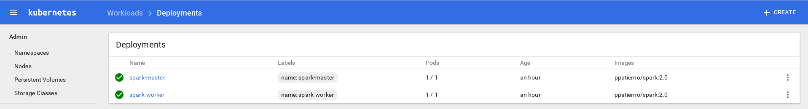
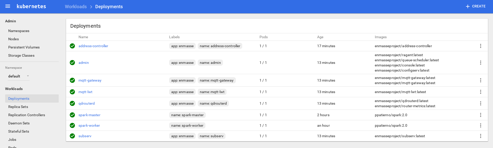

# EnMasse - Spark Streaming demo

This demo shows how it's possible to use a [Kubernetes](https://kubernetes.io/) or [OpenShift](https://www.openshift.com/) cluster running [EnMasse](https://enmasseproject.github.io/) and [Apache Spark](https://spark.apache.org/ in order to have a way for ingesting data through a scalable messaging infrastructure and then processing such data using Spark Streaming jobs.
The proposed IoT scenario is related to an AMQP publisher which sends simulated temperature values and a Spark Streaming job which processes such data in order to get the max value in the latest 5 seconds.

## Prerequisites

The main prerequisite is to have a Kubernetes or OpenShift cluster up and running for deploying EnMasse and the Apache Spark cluster. 

The Kubernetes cluster can be set up locally using [minikube](https://github.com/kubernetes/minikube) project or something like [Azure Container Service](https://azure.microsoft.com/en-us/services/container-service/) for example.

The OpenShift cluster can be set up locally using the `oc` tool as described in the following [guide](https://github.com/openshift/origin/blob/master/docs/cluster_up_down.md).

## Apache Spark

The current repo provides the following resources (in the `spark` directory) for deploying an Apache Spark cluster in _standalone mode_ made of one master node and one worker node.

* _Dockerfile_ : a Docker file for building an Apache Spark image
* _start-common.sh, start-master.sh, start-worker.sh_ : some bash files for starting the master and the worker node
* _spark-master.yaml, spark-master-service.yaml_ : YAML resources files which describe deployment and service for the master node to deploy on Kubernetes
* _spark-worker.yaml_ : YAML resources file which describes deployment for the worker node to deploy on Kubernetes

The above deployment files refer to the ppatierno/spark:2.0 image available on Docker Hub but you can re-build such image using the Dockerfile and then changing the image name in the related deployment files.

> Credits to [this](https://github.com/phatak-dev/kubernetes-spark) project and [this](https://github.com/kubernetes/kubernetes/tree/master/examples/spark) project for definining the above Dockerfile and YAML resources file for deploying Apache Spark on Kubernetes.

## Kubernetes

### Local minikube

> If you have re-built the Apache Spark image and you want to avoid pushing it to the Docker Hub, use the following command `docker save <image> | minikube ssh docker load` for making it available in the Docker images registry which is local to the virtual machine used by minikube.

In order to deploy the Spark master node and the related service :

        kubectl create -f spark-kubernetes/spark-master.yaml
        kubectl create -f spark-kubernetes/spark-master-service.yaml

With the current deployment, the Spark master service is reachable only inside the cluster (needed by the Spark worker node) but we are not able to submit Spark jobs from outside the cluster (i.e. from the host).
In order to do that we can patch the Spark master service changing its type from _ClusterIP_ to _NodePort_ in the following way :

        kubectl patch service spark-master -p '{"spec" : { "type" : "NodePort" }}'

After that, the Spark master service will expose ports 8080 and 7077 inside the cluster and different ports for being accessible from outside the cluser (node ports are assigned over 30000).
For example, running :

        kubectl get service

The output could be :

        NAME           CLUSTER-IP   EXTERNAL-IP   PORT(S)                         AGE
        kubernetes     10.0.0.1     <none>        443/TCP                         9m
        spark-master   10.0.0.197   <nodes>       8080:32592/TCP,7077:32304/TCP   6m

It means that inside the cluster the Spark master node ports are 8080 and 7077 but from outisde the cluster, using the `minikube` ip address, the exposed ports are 32592 (instead of 8080) and 32304 (instead of 7077).

> For getting the IP address of the virtual machine cluster, the command `minikube ip` can be used.

In order to deploy the Spark worker node :

        kubectl create -f spark-kubernetes/spark-worker.yaml

In order to deploy EnMasse you can follow this Getting Started [guide](https://github.com/EnMasseProject/enmasse/blob/master/documentation/getting-started/kubernetes.md) mainly based on downloading the latest EnMasse release from [here](https://github.com/EnMasseProject/enmasse/releases), unpack it and executing following commands for a manual deployment :

        kubectl create sa enmasse-service-account
        kubectl apply -f kubernetes/enmasse.yaml

After deploying EnMasse, instead of configuring "ingress" resources for accessing the messaging infrastructure outside of the cluster from the host, it's possible to execute the same patch as for the Spark master service, changing from _ClusterIP_ to _NodePort_ for the messaging service. If you want to access using MQTT protocol as well, the same thing should be done for the mqtt service.

        kubectl patch service messaging -p '{"spec" : { "type" : "NodePort" }}'
        kubectl patch service mqtt -p '{"spec" : { "type" : "NodePort" }}'

In this way, other then the default AMQP (5672, 5673) and MQTT (1883, 8883) ports, there will be other node ports useful for reaching such services from outside the cluster.

        NAME                 CLUSTER-IP   EXTERNAL-IP   PORT(S)                                                         AGE
        address-controller   10.0.0.56    <none>        8080/TCP,5672/TCP                                               7m
        admin                10.0.0.54    <none>        55672/TCP,5672/TCP,55667/TCP                                    3m
        kubernetes           10.0.0.1     <none>        443/TCP                                                         1h
        messaging            10.0.0.35    <nodes>       5672:32014/TCP,5671:32661/TCP,55673:32092/TCP,55672:30490/TCP   3m
        mqtt                 10.0.0.125   <nodes>       1883:31674/TCP,8883:30896/TCP                                   3m
        spark-master         10.0.0.197   <nodes>       8080:32592/TCP,7077:32304/TCP                                   1h
        subscription         10.0.0.178   <none>        5672/TCP                                                        3m

### Azure Container Service

TODO

## OpenShift

TODO

## Demo application

The demo application is provided by this [AMQP Spark Streaming demo](https://github.com/redhat-iot/amqp-spark-demo) repo where the scenario is the following :

* an AMQP publisher application sends simulated temperature values every seconds to the _temperature_ address
* an AMQP Spark driver application uses the [AMQP Spark Streaming connector](https://github.com/radanalyticsio/streaming-amqp) in order to receive such values from the same _temperature_ address and then executing a Spark job for getting max value in the latest 5 seconds

The above repo describes all the steps for setting up the demo running against an Apache Artemis broker instance using a queue named _temperature_ as destination.

For the current demo, the applications (publisher and Spark driver) are used in a different way with the _temperature_ address deployed as an anycast address in the EnMasse messaging infrastructure (so without the need for a broker). It means that there is no "store and forward" mechanism involved but "direct messaging" : only when the Spark driver application with the AMQP receiver is up and running, the publisher gets credits for start sending messages processed in real time by the Spark Streaming job itself.

The first needed step is to build the source code application as described [here](https://github.com/redhat-iot/amqp-spark-demo#building-the-demo-source-code).

In order to run both applications the steps needed are described [here](https://github.com/redhat-iot/amqp-spark-demo#running-demo-applications).
Regarding the AMQP publisher application, the _messaging_ service address/port will be specified; the same of the Spark driver other than the right address for the Spark master node.

