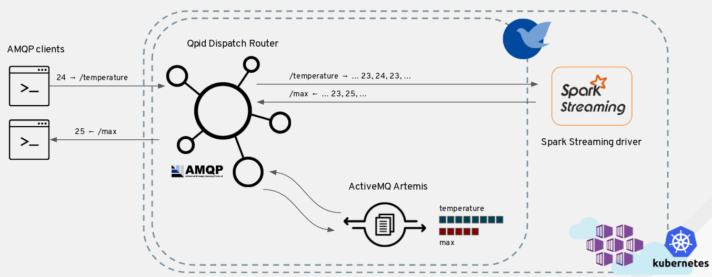
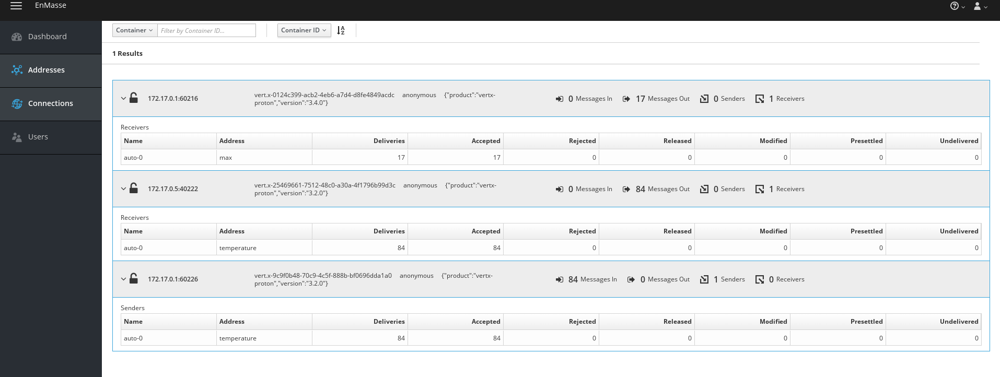
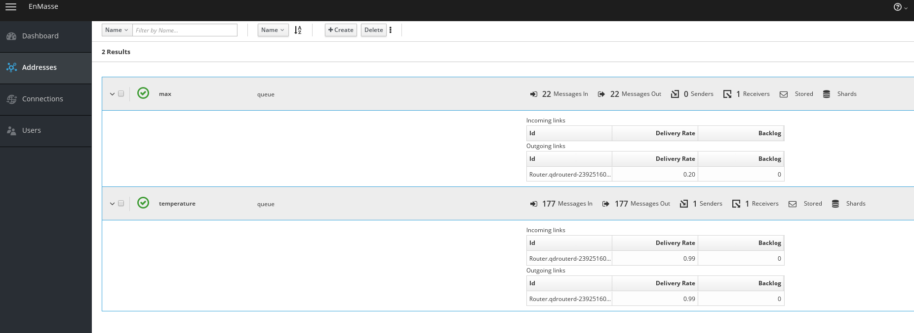

# EnMasse - Spark Streaming demo

This demo shows how it's possible to use a [Kubernetes](https://kubernetes.io/) or [OpenShift](https://www.openshift.com/) cluster running [EnMasse](https://enmasseproject.github.io/) and [Apache Spark](https://spark.apache.org/) in order to have a way for ingesting data through a scalable messaging infrastructure and then processing such data using Spark Streaming jobs.
The proposed IoT scenario is made of : 

* an AMQP publisher which sends simulated temperature values to a _temperature_ address (backed by a queue)
* a Spark Streaming driver application which reads above values in order to process the maximum value in the latest 5 seconds, sending the processed value to a _max_ address (backed by a queue)
* an AMQP receiver which gets filtered maximum temperature values reading from the _max_ address

The following pictures shows how all the above components define the overall demo deployment.

## Prerequisites

The main prerequisite is to have a Kubernetes or OpenShift cluster up and running for deploying EnMasse and the Apache Spark cluster. 

The Kubernetes cluster can be set up locally using [minikube](https://github.com/kubernetes/minikube) project or something like [Azure Container Service](https://azure.microsoft.com/en-us/services/container-service/) for example.

The OpenShift cluster can be set up locally using the `oc` tool as described in the following [guide](https://github.com/openshift/origin/blob/master/docs/cluster_up_down.md).

## Apache Spark

The current repo provides the following resources (in the `spark` directory) for deploying an Apache Spark cluster in _standalone mode_ made of one master node and one worker node.

* _Dockerfile_ : a Docker file for building an Apache Spark image
* _start-common.sh, start-master.sh, start-worker.sh_ : bash files for starting the master and the worker node
* _spark-master.yaml, spark-master-service.yaml_ : YAML resources files which describe Kubernetes/OpenShift deployments and services for the master node to deploy
* _spark-worker.yaml_ : YAML resources file which describes Kubernetes/OpenShift deployment for the worker node

The above deployment files refer to the ppatierno/spark:2.0 image available on Docker Hub but you can re-build such image using the Dockerfile and then changing the image name in the related deployment files.

> Credits to [this](https://github.com/phatak-dev/kubernetes-spark) and [this](https://github.com/kubernetes/kubernetes/tree/master/examples/spark) projects for defining the above Dockerfile(s) and YAML resources files for deploying Apache Spark on Kubernetes. The OpenShift deployment is provided through the [radanalytics.io](http://radanalytics.io/) project.

## Kubernetes

### Local minikube

> If you have re-built the Apache Spark image and you want to avoid pushing it to the Docker Hub, use the following command `docker save <image> | minikube ssh docker load` for making it available in the Docker images registry which is local to the virtual machine used by minikube.

For deploying all this stuff, the default virtual machine size used by minikube (2 CPU cores and 2048 GB of RAM) isn't enough so it's better to start minikube with more resources like this.

        minikube start --cpus=4 --memory=4096

In order to deploy the Spark master node and the related service :

        kubectl create -f spark-kubernetes/spark-master.yaml
        kubectl create -f spark-kubernetes/spark-master-service.yaml

In order to deploy the Spark worker node :

        kubectl create -f spark-kubernetes/spark-worker.yaml

Before deploying EnMasse, in order to have the console accessible from outside the cluster we need to enable the minikube _ingress_ addon.

        minikube addons enable ingress

which will spin up an Nginx ingress controller pod for handling _ingress_ resources.

In order to deploy EnMasse you can follow this Getting Started [guide](https://github.com/EnMasseProject/enmasse/blob/master/documentation/getting-started/kubernetes.md) mainly based on downloading the latest EnMasse release from [here](https://github.com/EnMasseProject/enmasse/releases), unpack it and executing following commands for a manual deployment :

        kubectl create sa enmasse-service-account
        kubectl apply -f kubernetes/enmasse.yaml

After deploying EnMasse, the address controller and the console are accessible through pre-configured _ingress_ but instead of doing the same for accessing the messaging infrastructure outside of the cluster from the host (through AMQP and MQTT), it's possible to execute a patch changing from _ClusterIP_ to _NodePort_ for the _messaging_ service. 
If you want to access using MQTT protocol as well, the same thing should be done for the _mqtt_ service.

        kubectl patch service messaging -p '{"spec" : { "type" : "NodePort" }}'
        kubectl patch service mqtt -p '{"spec" : { "type" : "NodePort" }}'

In this way, other then the default AMQP (5672, 5673) and MQTT (1883, 8883) ports, there will be other node ports useful for reaching such services from outside the cluster using
the minikube IP address.

        NAME                 CLUSTER-IP   EXTERNAL-IP   PORT(S)                                                         AGE
        address-controller   10.0.0.56    <none>        8080/TCP,5672/TCP                                               7m
        admin                10.0.0.54    <none>        55672/TCP,5672/TCP,55667/TCP                                    3m
        kubernetes           10.0.0.1     <none>        443/TCP                                                         1h
        messaging            10.0.0.35    <nodes>       5672:32014/TCP,5671:32661/TCP,55673:32092/TCP,55672:30490/TCP   3m
        mqtt                 10.0.0.125   <nodes>       1883:31674/TCP,8883:30896/TCP                                   3m
        spark-master         10.0.0.197   <nodes>       8080:32592/TCP,7077:32304/TCP                                   1h
        subscription         10.0.0.178   <none>        5672/TCP                                                        3m

> For getting the IP address of the virtual machine cluster, the command `minikube ip` can be used.

Finally you should see the console at http://<minikube ip>/.

And interacting with the address controller at http://<minikube ip>:<exposed port>/v3/address.

### Azure Container Service

In order to use the ACS, the first step is to deploy a Kubernetes cluster following the official [walkthrough](https://docs.microsoft.com/en-us/azure/container-service/container-service-kubernetes-walkthrough).

For EnMasse, a specific YAML file is provided in order to add other services marked as "external" (for messaging, mqtt, ...) which are exposed outside the cluster using the cloud provider load balancer.

        kubectl apply -f kubernetes/addons/external-lb.yaml

So finally the exposed services are the following :

        NAME                          CLUSTER-IP     EXTERNAL-IP      PORT(S)                                 AGE
        address-controller            10.0.194.238   <none>           8080/TCP,5672/TCP                       11m
        address-controller-external   10.0.68.163    52.169.146.241   8080:32595/TCP,5672:31099/TCP           3m
        admin                         10.0.122.222   <none>           55672/TCP,5672/TCP,55667/TCP            11m
        console-external              10.0.196.37    52.169.145.32    56720:32351/TCP,8080:31811/TCP          3m
        kubernetes                    10.0.0.1       <none>           443/TCP                                 31m
        messaging                     10.0.158.202   <none>           5672/TCP,5671/TCP,55673/TCP,55672/TCP   11m
        messaging-external            10.0.253.186   52.164.120.234   5672:31398/TCP,5671:31813/TCP           3m
        mqtt                          10.0.93.42     <none>           1883/TCP,8883/TCP                       11m
        mqtt-external                 10.0.12.156    13.74.150.148    1883:31653/TCP,8883:30343/TCP           3m
        spark-master                  10.0.201.123   13.74.165.147    8080:31207/TCP,7077:30753/TCP           21m
        subscription                  10.0.184.112   <none>           5672/TCP                                11m

In the ACS deployment, "external" services are accessible to the assigned external IP using the default port (i.e. 5672 for messaging, 1883 for mqtt, ...).

## OpenShift

TODO

## Demo application

The demo application is provided through the following modules :

* _spark driver_: the Spark Streaming driver application included in the related Docker image for running inside the deployed cluster
* _amqp_clients_: this provides the AMQP publisher and receiver clients for sending simulated temperature values and getting filtered maximum values

### Deploying addresses

As said, the demo is about the AMQP publisher which sends temperature values to the _temperature_ address and an AMQP receiver which receives filtered max values (in the latest 5 seconds) from the _max_ address.
This address can be used in a _direct messaging_ fashion or deploying two queues in EnMasse in order to leverage on buffering messages through a broker without pushing so much on the Spark Streaming application.
In order to do that, an addresses JSON description file is provided and can be deployed in the following way :

        curl -X PUT -H "content-type: application/json" --data-binary @./addresses/addresses.json http://<address_controller_ip>:<address_controller_port>/v3/address

Where the values of the `address_controller_ip` and `address_controller_port` depends on where the cluster is deployed (locally with minikube or in the cloud with ACS).

It's possible doing the same using the EnMasse console directly.

### Spark driver application

The `spark-driver` directory provides the Spark Streaming driver application and a Docker image for running the related Spark driver inside the cluster.
This application can be packaged in the following way :

        mvn package -Pbuild-docker-image

After that, the built Docker image can be deployed to the cluster with this command :

        kubectl create -f <path-to-repo>/spark-driver/target/fabric8/spark-driver-svc.yaml
        
### AMQP clients

The AMQP publisher can be launched in this way from the `amqp-clients` directory after packaging them :

        java -jar ./target/amqp-publisher.jar <messaging_ip> <messaging_port> temperature

providing the _messaging_ IP address and port and the _temperature_ address for sending values.
In the same way the AMQP receiver :

        java -jar ./target/amqp-receiver.jar <messaging_ip> <messaging_port> max

providing the _messaging_ IP address and port and the _max_ address for reading filtered maximum values.

### A view from the EnMasse console

Following picture shows how there is a connection from the publisher on the _temperature_ address sending values, a connection from the final receiver on the _max_ address 
for getting filtered maximum values and finally a receiver (the Spark Streaming driver) on the _temperature_ address as well getting values for streaming analytics.

In this picture, the _temperature_ and _max_ addresses are showed with more information even related to the AMQP links created against them.

