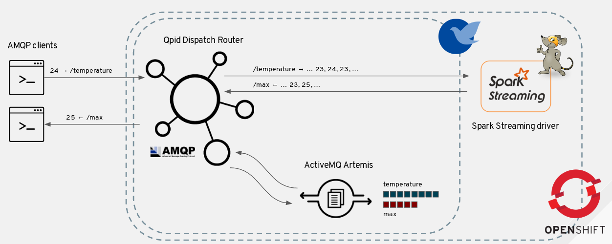
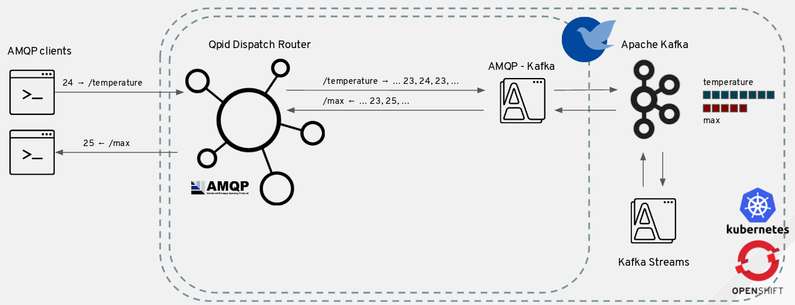

This repository contains all the bits for setting up the demo of the "Open sourcing the IoT : running EnMasse on Kubernetes" session at "Industry 4.0 & AgileIoT" by Paolo Patierno. Other than the source code following :

* [Slide deck](https://www.slideshare.net/paolopat/open-sourcing-the-iot-enmasse-running-on-kubernetes)
* A [video](https://www.youtube.com/watch?v=Qy47WXl4h5w) about the demo

# EnMasse - IoT demo

This demo shows how it's possible to use a [Kubernetes](https://kubernetes.io/) or [OpenShift](https://www.openshift.com/) cluster running [EnMasse](https://enmasseproject.github.io/) and [Apache Spark](https://spark.apache.org/) in order to have a way for ingesting data through a scalable messaging infrastructure and then processing such data using Spark Streaming jobs or Kafka Streams API.
The proposed IoT scenario is made of : 

* an AMQP publisher which sends simulated temperature values to a _temperature_ address (backed by a queue or a Kafka topic)
* a Spark Streaming driver application which reads above values in order to process the maximum value in the latest 5 seconds, sending the processed value to a _max_ address (backed by a queue or a Kafka topic)
* an AMQP receiver which gets filtered maximum temperature values reading from the _max_ address

The following pictures shows how all the above components define the overall demo deployment using Kubernetes (running inside or outsice ACS), EnMasse and Apache Spark.

The same solution can be deployed on OpenShift using the Apache Spark provided by the [radanalytics.io](https://radanalytics.io/) project.

Finally, this picture shows the deployment using Apache Kafka for storing ingested data but always through the AMQP protocol (so using an AMQP - Kafka bridge) and then a Kafka Streams application for real time analytics.

The description about the two different solutions can be found here :

* [Using Apache Spark Streaming](./spark.md)
* [Using Apache Kafka Streams](./kafka.md)
