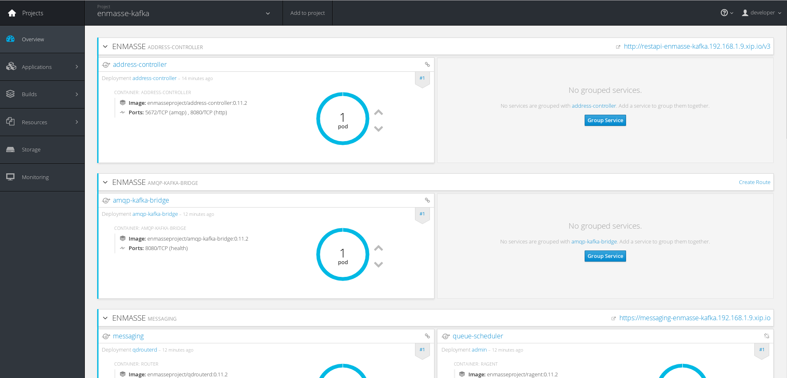

This section describes how set up the demo using Apache Kafka for storing data and the Kafka Streams API for real time analytics.

## Prerequisites

The main prerequisite is to have a Kubernetes or OpenShift cluster up and running for deploying EnMasse with the Apache Kafka supports which include an AMQP - Kafka bridge.

The Kubernetes cluster can be set up locally using [minikube](https://github.com/kubernetes/minikube) project or something like [Azure Container Service](https://azure.microsoft.com/en-us/services/container-service/) for example.

The OpenShift cluster can be set up locally using the `oc` tool as described in the following [guide](https://github.com/openshift/origin/blob/master/docs/cluster_up_down.md).

## Kubernetes

### Local minikube

TBD

## OpenShift

After having the OpenShift cluster up and running using the `oc` tool, the first step is to deploy an Apache Kafka cluster inside it.

Before deploying all the stuff, let's create a dedicated project.

        oc new-project enmasse-kafka

### Deploying the Apache Kafka cluster

The Apache Kafka cluster deployment is based on Stateful Sets and, for demo purpose, it's just made of one Zookeeper instance and three Apache Kafka replicas.
Furthermore, it uses persistent volumes for storing Zookeeper and Kafka brokers data (i.e. logs, consumer offsets, ...).
For a local development, we can just use local drive for that but creating directory with read/write access permissions is needed.

    mkdir /tmp/kafka-a
    chmod 777 /tmp/kafka-a
    mkdir /tmp/kafka-b
    chmod 777 /tmp/kafka-b
    mkdir /tmp/kafka-c
    chmod 777 /tmp/kafka-c
    mkdir /tmp/kafka-d
    chmod 777 /tmp/kafka-d

In this way we have two different directories that will be used as persistent volumes by the OpenShift resources YAML files.

After making available above accessible directories, the persistent volumes need to be deployed by OpenShift administrator. In this case you can just login
as system admin on your local OpenShift cluster for doing that.

    oc login -u system:admin

The persistent volumes can be deployed in the following way :

    oc create -f https://raw.githubusercontent.com/EnMasseProject/barnabas/master/kafka-statefulsets/resources/cluster-volumes.yaml -n enmasse-kafka

After that you can return to be a "developer" user.

    oc login -u developer

Then, the Zookeeper services and stateful sets can be created.

    oc create -f https://raw.githubusercontent.com/EnMasseProject/barnabas/master/kafka-statefulsets/resources/zookeeper-headless-service.yaml -n enmasse-kafka
    oc create -f https://raw.githubusercontent.com/EnMasseProject/barnabas/master/kafka-statefulsets/resources/zookeeper-service.yaml -n enmasse-kafka
    oc create -f https://raw.githubusercontent.com/EnMasseProject/barnabas/master/kafka-statefulsets/resources/zookeeper.yaml -n enmasse-kafka

Finally, the Kafka services and broker stateful sets.

    oc create -f https://raw.githubusercontent.com/EnMasseProject/barnabas/master/kafka-statefulsets/resources/kafka-headless-service.yaml -n enmasse-kafka
    oc create -f https://raw.githubusercontent.com/EnMasseProject/barnabas/master/kafka-statefulsets/resources/kafka-service.yaml -n enmasse-kafka
    oc create -f https://raw.githubusercontent.com/EnMasseProject/barnabas/master/kafka-statefulsets/resources/kafka.yaml -n enmasse-kafka

Accessing the OpenShift console, the current deployment should be visible.

### Deploying EnMasse with Kafka support

In order to deploy EnMasse you can follow this Getting Started [guide](https://github.com/EnMasseProject/enmasse/blob/master/documentation/getting-started/openshift.md) mainly based on executing following commands for a manual installation.

First of all, some permissions need to be granted :

        oc create sa enmasse-service-account -n enmasse-kafka
        oc policy add-role-to-user view system:serviceaccount:enmasse-kafka:default
        oc policy add-role-to-user edit system:serviceaccount:enmasse-kafka:enmasse-service-account

EnMasse is provided with different templates which are able to provision the components with/without SSL/TLS support for example or with/without Kafka support.
For this demo, the template with Kafka support is needed and the entire EnMasse infrastracture can be deployed in the following way :

        oc process -f openshift/enmasse-with-kafka.yaml  | oc create -n enmasse-kafka -f -

The final deployment is visible using the OpenShift console.

There are a bunch of components related to the messaging layer (for connecting through AMQP protocol), the administration, the MQTT protocol gateway and finally
the AMQP - Kafka bridge.

## Demo application

The demo application is provided through the following modules :

* _kafka_streams_app_: the Kafka Streams application included in the related Docker image for running inside the deployed cluster
* _amqp_clients_: this provides the AMQP publisher and receiver clients for sending simulated temperature values and getting filtered maximum values

### Kafka Streams application

The `kafka-streams-app` directory provides the Kafka Streams application and a Docker image for running the related application inside the cluster.
This application can be packaged in the following way :

        mvn package -Pbuild-docker-image

#### Kubernetes

After that, the built Docker image can be deployed to the cluster with this command :

        kubectl create -f <path-to-repo>/kafka-streams-app/target/fabric8/kafka-streams-app-deployment.yml -n enmasse-kafka

#### OpenShift

After that, the built Docker image can be deployed to the cluster with this command :

        oc create -f <path-to-repo>/kafka-streams-app/target/fabric8/kafka-streams-app-deployment.yml -n enmasse-kafka

### AMQP clients

The AMQP publisher can be launched in this way from the `amqp-clients` directory after packaging them :

        java -jar ./target/amqp-publisher.jar <messaging_ip> <messaging_port> kafka.temperature

providing the _messaging_ service IP address and port and the _kafka.temperature_ address for sending values.
In the same way the AMQP receiver :

        java -jar ./target/amqp-receiver.jar <messaging_ip> <messaging_port> kafka.max/group.id/my_group

providing the _messaging_ service IP address and port and the _kafka.max_ address for reading filtered maximum values,
specifying even the "group-id" (i.e. my_group) as a Kafka consumer but over AMQP through the AMQP - Kafka bridge.